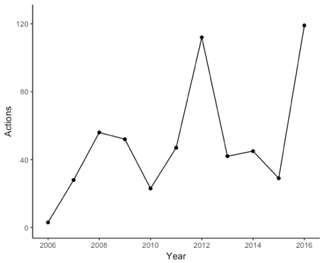
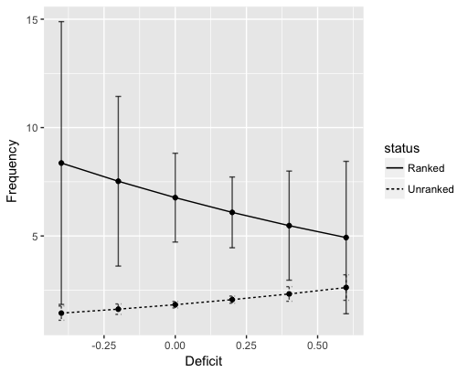
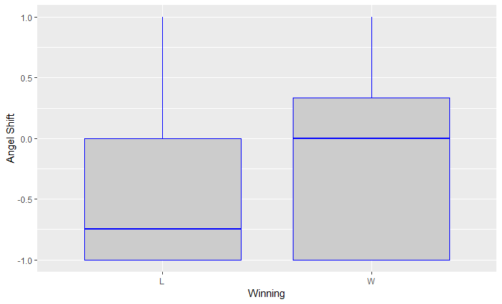
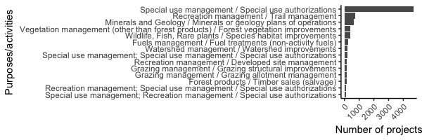
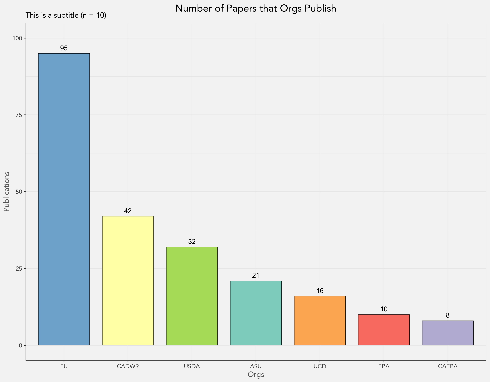

Visualization
================
R-Ladies | R-Fem Davis Chapter
10/26/2018

### This week, we decided to share simple visualizations using ggplot and splot.

``` r
# libraries need to generate plots like those described below
library(ggplot2)
library(RColorBrewer)
library(sp)
library(reshape)
library(dplyr)
```

<br>

#### (1) The number of legislative actions related to drought, over time in Chile.

``` r
ggplot(yrLeg, aes(Year, Actions, group = g)) +
  geom_point() + 
  geom_line() +
  scale_x_discrete(breaks=c(2006,2008,2010,2012,2014,2016)) +
  theme_classic() 

# "YrLeg" is the dataset
# "group" is necessary for geom_line, so g = 1 to link the points together
# "scale_x_discrete" = break the x (or y) axis the way you want to
# "theme_classic" = set the theme so all figures in paper are consistent
```



<br>

#### (2) Predicted probabilities for the rate of legislative speech based on drought severity in electoral districts in Australia.

``` r
senate = ggplot(pp_res, aes(relDefRev, fit, group = status, linetype = status)) +
  geom_line() +
  geom_point() + 
  geom_errorbar(aes(ymin=lower, ymax=higher), width=0.02, alpha=0.7) +
  ylab("Frequency") +
  ylim(0, 17) +
  xlab("Drought")

# "pp_res" df includes calculated confidence intervals (lower, higher)
# "geom_errorbar" = plotting confidence intervals (width and alpha set bar size)
# "ylim"" = sets y axis limit
```



<br>

#### (3) Boxplot illustrating differences between winners and losers in devil/angel shift hypothesis.

``` r
ggplot(npf2, aes(x=winning, y=angel_shift, group=winning))+
  geom_boxplot(fill = "grey80", colour = "blue") +
  xlab("Winning") +
  ylab("Angel Shift")

# "geom_boxplot" = create boxplot, good visualization of t-test results
```



<br>

#### (4) A quick and dirty chloropeth map. Be sure there aren't any missing values in your dataset!

``` r
spplot(shp, "residual", at=quantile(shp$residual), col.regions=brewer.pal(n=4, "RdBu"),
main="Residuals from OLS") 

# shp = name of baltimore census shapefile
# residual = column (variable) that I'm visualizing
# "at" argument tells R where the color breaks are
# "col.regions" argument gives you a color scheme (here, RColorBrewer)
# main is the title
```

<br>

#### (5) Using a chloropeth map to show the statistically significant food deserts and food swamps in Baltimore.

``` r
spplot(mkts, "localgstar", main="Local Gi* Accessibility Clustering", at=c(-4, -1.96, 1.96, 5), col.regions=rev(brewer.pal(n=2, "RdBu"))) 

# use z-score cut-offs (1.96) to show statistically significant cold spots
```

<br>

#### (6) Barplot showing the number of projects that fall into a particular category of USFS purposes/activities.

``` r
ggplot(comb_c, aes(x = reorder(Purpose.Activity, n), y=n)) +
  geom_bar(stat="identity") +
  theme_classic() +
  coord_flip() +
  theme(axis.text.x = element_text(angle = 45, vjust = 1, hjust=1)) +
  ggtitle("Number of activities listed across all projects") +
  xlab("Purposes/activities") +
  ylab("Number of projects")

# "coord_flip" = turn x to y axis and vice versa (good for long names)
# "theme(axis.text.x)..." = adjust axis text angle
```



<br>

#### (7) A little more involved:

You can create your own theme! Set up your theme at the beginning of your script. That way, if you are making a bunch of charts/figures for a single manuscript, you can use one word "My Theme" to apply the same theme throughout. This saves a ton of time. In this case, I took a base theme (theme\_bw) and placed it into a function -- then, using the "%+replace%" you can adjust aspects of the theme. The ggplot2 base themes are here: <https://ggplot2.tidyverse.org/reference/ggtheme.html>.

``` r
MyTheme <- function () { 
  theme_bw(base_size=12, base_family="Avenir") %+replace% 
    theme(
      panel.background  = element_blank(),
      plot.background = element_rect(fill="gray96", colour=NA), 
      legend.background = element_rect(fill="transparent", colour=NA),
      legend.key = element_rect(fill="transparent", colour=NA),
      plot.title = element_text(color="black",face="plain",size=16,hjust=-1),
      axis.title = element_text(color="#666666", face = "plain", size = 12),
      plot.subtitle = element_text(color= "#666666", size = 12)
    )
}
```

You can also set up colors, as demonstrated below. When using ggplot, you can add a code line The "brewer.pal"" colorsets can be viewed here: <http://www.datavis.ca/sasmac/brewerpal.html>.

``` r
ThematicColors <- brewer.pal(7, "Set3") 
# 'saves' 7 color values from Color Brewer Set 3 to the object, ThematicColors

names(ThematicColors) <- levels(survey$Org) 
# assigns each factor level (categories from Adjust order of data) to the 3 colors

colScale <- scale_fill_manual(name = "Org", values = ThematicColors) 
# sets up custom color scale that matches each category (from Adust order of data) to the three colors selected from Color Brewer

# Now, using ggplot, you can just add a code line "+ colScale" (see example below)
```

Now, plot the survey data by "Org" and then sum the \# of publications by Org.

``` r
Chart.plot <- ggplot(survey1, aes(reorder(Org, -Sum_grp), Sum_grp, 
                                  width = 0.8, fill=Org)) +
  geom_bar(position = position_dodge(width = 0.8), 
           color="black", size=0.2, stat = "identity", width = 0.9) +
  MyTheme() +
  labs(title = "Number of Papers that Orgs Publish", 
       subtitle = "This is a subtitle (n = 10)") +
  ylab("Publications") +
  xlab("Orgs") +
  theme(legend.position = "none" )+
  scale_y_continuous(limits = c(0,100))+
  colScale +
  geom_text(aes(label = survey1$Sum_grp, vjust = -0.65));Chart.plot

# x-axis = uses "Org" column and orders them based on descending # of publications  
# y-axis = "# of Pubs"
# fill = "Org" means fill the bars based on the "Org" categories
# legend.position = "none" means there is no legend
# scale_y_continuous = sets the min and max limits for the y axis
# colScale = from code above that aligns colors to the Org categories
# geom_text vjust = the vertical adjustment/offset of the data values
```


